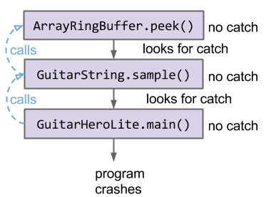
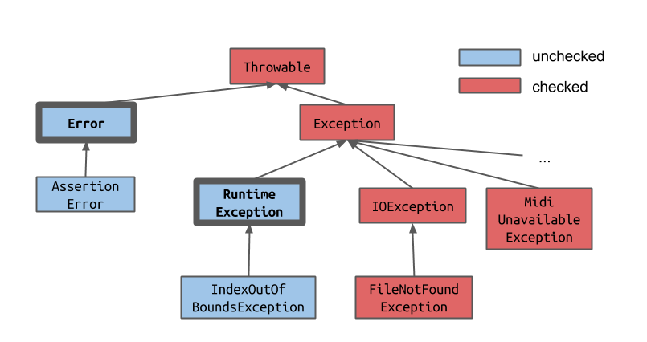

# Chapter 6

## Iteration

```java
Set<String> s = new HashSet<>();
...
for (String city : s) {
    ...
}
```

等价于

```java
Set<String> s = new HashSet<>();
...
Iterator<String> seer = s.iterator();
while (seer.hasNext()) {
    String city = seer.next();
    ...
}
```

### 让自己的数据类型也可以被这样遍历:

```java
public class ArraySet<T> implements Iterable {
    @Override	
    public Iterator<T> iterator() {
        return new ArraySetIterator();
    }
    
    private class ArraySetIterator implements Iterator<T> {
        private int pos;

        public ArraySetIterator() {
            pos = 0;
        }

        @Override
        public boolean hasNext() {
            return pos < size;
        }

        @Override
        public T next() {
            T thisItem = array[pos];
            pos += 1;
            return thisItem;
        }
    }
}
```

## Error & Exceptions

### Unchecked Exceptions
We can throw our own exceptions, using the throw keyword:
```java
public V get(K key) {
    intlocation = findKey(key);
if(location < 0) {
    throw newIllegalArgumentException("Key " + key + " does not exist in map."\); 
}
    return values[findKey(key)];
}
```

#### Catching Exceptions

> `try` 后的内容一定会被执行，如果有 `Exception` 就会检查是否可以被 `catch`，若被 `catch` 则执行其后的内容，寻找 `catch` 是从内向外寻找。程序不会中止。

> 错误（Error）通常不应该被捕获和处理。错误表示严重的问题，通常是由于系统故障、资源耗尽或其他不可恢复的情况引起的。捕获和处理错误可能会导致不可预测的行为，因为错误通常表示程序无法继续正常执行。
> 在Java中，Error类及其子类是Throwable类的一种形式，但通常不建议捕获和处理Error。相反，建议让错误传播到更高级别的代码（如JVM或操作系统）来处理。这样可以确保错误得到适当的处理，例如记录错误日志或进行紧急的系统维护。
> 虽然Java语法上允许捕获和处理Error，但这种做法是不推荐的，并且在大多数情况下是不必要的。应该将捕获和处理的重点放在异常（Exception）上，而不是错误（Error）。

```java
Dog d = new Dog("Lucy", "Retriever", 80);
d.becomeAngry();

try {
    d.receivePat();
} catch (Exception e) {
    System.out.println(
    "Tried to pat: " + e);
    d.eatTreat("banana");
} 
d.receivePat();
System.out.println(d);
```
结果：
```shell
$ java ExceptionDemo
Tried to pat: java.lang.RuntimeException: grrr... snarl snarl
Lucy munches the banana

Lucy enjoys the pat.

Lucy is a happy Retriever weighing 80.0 standard lb units.
```

One try can contain several operations, the exceptions can be caught by several `catch` key words.

```java
func readFile: {
    try {
        open the file;
        determine its size;
        allocate that much memory;
        read the file into memory;
        close the file;
    } catch (fileOpenFailed) {
        doSomething;
    } catch (sizeDeterminationFailed) {
        doSomething;
    } catch (memoryAllocationFailed) {
        doSomething;
    } catch (readFailed) {
        doSomething;    
    } catch (fileCloseFailed) {
        doSomething;
    }
}
```



### Checked vs Unchecked Exceptions

**Type of Exceptions**
- Checked
- Unchecked Exceptions



Errors and Runtime Exceptions, and all their children, are unchecked. These are errors that cannot be known until runtime. They also tend to be ones that can't be recovered from -- what can you do to fix it if the code tries to get the -1 element from an array? Not much.

Everything else is a checked exception. Most of these have productive fixes. For instance, if we run into a FileNotFound Exception, perhaps we can ask the user to re-specify the file they want -- they might have mistyped it.

There are two ways to handle a checked error:

#### Catch

```java
public static void gulgate() {
    try {
        if (today == “Thursday”) { 
            throw new IOException("hi"); 
        }
    } catch (Exception e) {
        System.out.println("psych!");
    }
}
```

#### Specify

```java
public static void gulgate() throws IOException {
... throw new IOException("hi"); ...
}
```

相应的，到了调用 `gulgate` 的函数中，你可以选择 `catch` 或者 `throw` 关键字