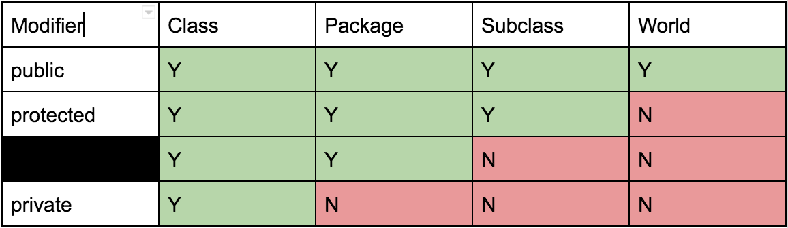

# Chapter 7

## Access Control



**Default Package** Code that does not have a package declaration is automatically part of the default package. If these classes have members that don’t have access modifiers (i.e. are package-private), then because everything is part of the same (unnamed) default package, these members are still accessible between these “default”-package classes.

**Access is Based Only on Static Types** It is important to note that for interfaces, the default access for its methods is actually public, and not package-private. Additionally, like this subtitle indicates, the access depends only on the static types.

Given the following code, which lines in the demoAccess method, if any, will error during compile time?

```java
package universe;
public interface BlackHole {
    void add(Object x); // this method is public, not package-private!
}

package universe;
public class CreationUtils {
    public static BlackHole hirsute() {
         return new HasHair();
    }
}

package universe;
class HasHair implements BlackHole {
    Object[] items;
    public void add(Object o) { ... }
    public Object get(int k) { ... }
}

import static CreationUtils.hirsute;
class Client {
   void demoAccess() {
      BlackHole b = hirsute();
      b.add("horse");
      b.get(0);
      HasHair hb = (HasHair) b;
   }
}
```

**Answer**
- `b.get(0);` This line errors because `b` is of static type BlackHole, but the `BlackHole` interface does not define a `get` method! Even though you and I both know that `b` is dynamically a `HasHair`, and thus has the `get` method, the compiler bases its checks off the static type.
- `HasHair hb = (HasHair) b;` This one is tricky, but notice that the `HasHair` class is not a public class - it's package-private. This means that `Client`, a class outside of the universe package, can't see that the `HasHair` class exists.

## Default Package

Any Java class without an explicit package name at the top of the file is automatically considered to be part of the “default” package. However, when writing real programs, you should avoid leaving your files in the default package (unless it’s a very small example program). This is because code from the default package cannot be imported, and it is possible to accidentally create classes with the same name under the default package.

For example, if I were to create a “DogLauncher.java” class in the default package, I would be unable to access this DogLauncher class anywhere else outside of the default package.

```java
DogLauncher.launch(); // won’t work
default.DogLauncher.launch(); // doesn’t exist
```

Therefore, your Java files should generally start with an explicit package declaration.