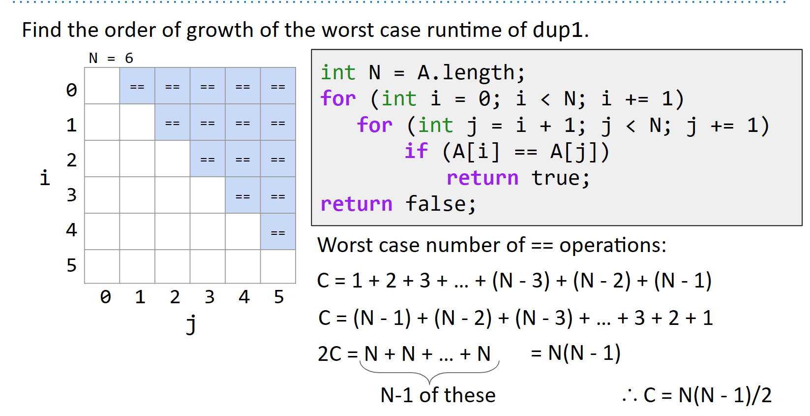

# Chapter 8

## 8.1 

**Encapsulation** 
- Module: A set of methods that work together as a whole to perform some task or set of related tasks.
- Encapsulated: A module is said to be encapsulated if its implementation is completely hidden, and it can be accessed only through a documented interface.

**Delegation vs Extension**

```java
// Extension
public class ExtensionStack<Item> extends LinkedList<Item> {
    public void push(Item x) {
        add(x);
    }
}

// Delegation
public class DelegationStack<Item> {
    private LinkedList<Item> L = new LinkedList<Item>();
    public void push(Item x) {
        L.add(x);
    }
}
```

Extension tends to be used when you know what is going on in the parent class. In other words, you know how the methods are implemented. Additionally, with extension, you are basically saying that the class you are extending from acts similarly to the one that is doing the extending. On the other hand, Delegation is when you do not want to consider your current class to be a version of the class that you are pulling the method from.

**Views**
Views are an alternative representation of an existed object. Views essentially limit the access that the user has to the underlying object. However, changes done through the views will affect the actual object.

```java
public static void main(String[] args) {
    /** Create an ArrayList. */
    List<Integer> L = new ArrayList<>();

    L.add(0); L.add(1); L.add(2);
    L.add(3); L.add(4);

    List sl = L.subList(1, 4);
    sl.add(9999);
    sl.set(0, 1000);
    System.out.println(L);
}
```

```shell
[0, 1000, 2, 3, 9999, 4]
```

## 8.2

**Runtime Minimization.** One of the most important properties of a program is the time it takes to execute. One goal as a programmer is to minimize the time (in seconds) that a program takes to complete.

**Runtime Measurement.** Some natural techniques:

- Measure the number of seconds that a program takes to complete using a stopwatch (either physical or in software). This tells you the actual runtime, but is dependent on the machine and inputs.
- Count the number of operations needed for inputs of a given size. This is a machine independent analysis, but still depends on the input, and also doesn’t actually tell you how long the code takes to run.
- Derive an algebraic expression relating the number of operations to the size of an input. This tells you how the algorithm scales, but does not tell you how long the code takes to run.

**Algorithm Scaling.** While we ultimately care about the runtime of an algorithm in seconds, we’ll often say that one algorithm is better than another simply because of how it scales. By scaling, we mean how the runtime of a piece of code grows as a function of its input size. For example, inserting at the beginning of ArrayList on an old computer might take $R(n) = 0.0001N$ seconds, where $N$ is the size of the list.

For example, if the runtime of two algorithms is $R_1(N) = N^2$, and $R_2(N) = 5000 + N$, we’d say algorithm 2 is better, even though $R_1$ is much faster for small $N$.

A rough justification for this argument is that performance critical situations are exactly those for which $N$ is “large”, though this is not an obvious fact. In almost all cases we’d prefer the linear algorithm. In some limited real-world situations like matrix multiplication, one might select one algorithm for small $N$, and another algorithm for large $N$. We won’t do this in 61B.

**Simplfying Algebraic Runtime.** We utilize four simplifications to make runtime analysis simpler.

- Pick an arbitrary option to be our *cost model*, e.g. # of array accesses.
- Focus on the worst case, i.e. if the number of operations is between $1$ and $2N + 1$, consider only the $2N + 1$.
- Ignore small inputs, e.g. treat $2N + 1$ just like $2N$.
- Ignore constant scaling factor, e.g. treat $2N$ just like $N$.

As an example, if we have an algorithm that performs between $N$ and $2N + 1$ increment operations and between $N$ and $4N^2 + 2N + 6$ compares, our intuitive simplifications will lead us to say that this algorithm has a runtime proportional to $N^2$.

The cost model is simply an operation that we’re picking to represent the entire piece of code. Make sure to pick an appropriate cost model! If we had chosen the number of increment operations as our cost model, we’d mistakenly determine that the runtime was proportional to $N$. This is incorrect since for large $N$, the comparisons will vastly outnumber the increments.

**Order of Growth.** The result of applying our last 3 simplifications gives us the order of growth of a function. So for example, suppose $R(N) = 4N^2 + 3N + 6$, we’d say that the order of growth of $R(N)$ is $N^2$.

The terms “constant”, “linear”, and “quadratic” are often used for algorithms with order of growth $1$, $N$, and $N^2$, respectively. For example, we might say that an algorithm with runtime $4N^2 + 3N + 6$ is quadratic.

**Simplified Analysis.** We can apply our simplifications in advance. Rather than computing the number of operations for ALL operations, we can pick a specific operation as our cost model and count only that operation.

Once we’ve chosen a cost model, we can either:

- Compute the exact expression that counts the number of operations.
- Use intuition and inspection to find the order of growth of the number of operations.

This latter approach is generally preferable, but requires a lot of practice. One common intuitive/inspection-based approach is use geometric intuition. For example, if we have nested for loops where i goes from 0 to N, and j goes from i + 1 to N, we observe that the runtime is effectively given by a right triangle of side length N. Since the area of a such a triangle grows quadratically, the order of growth of the runtime is quadratic.



**Big Theta.** To formalize our intuitive simplifications, we introduce Big-Theta notation. We say that a function $R(N) \in \Theta (f(N))$ if there exists positive constants $k_1$ and $k_2$ such that $k_1f_1(N) \le R(N) \le k_2f_2(N)$.

Many authors write $R(N) = \Theta(f(N))$ instead of $R(N) \in \Theta (f(N))$. You may use either notation as you please. I will use them interchangeably.

When using ΘΘ to capture a function’s asymptotic scaling, we avoid unnecessary terms in our ΘΘ expression. For example, while $4N^2 + 3N + 6 \in \Theta (4N^2 + 3N)$, we will usually make the simpler claim that is $4N^2 + 3N + 6 \in \Theta (N^2)$.

Big Theta is exactly equivalent to order of growth. That is, if a function $R(N)$ has order of growth $N^2$, then we also have that $R(N) \in \Theta (f(N))$.

## 8.3

**Runtime Analysis.** Understanding the runtime of code involves deep thought. It amounts to asking: “How long does it take to do stuff?”, where stuff can be any conceivable computational process whatsoever. It simply cannot be done mechanically, at least for non-trivial problems. As an example, a pair of nested for loops does NOT mean $\Theta (N^2)$ runtime as we saw in lecture.

**Cost Model.** As an anchor for your thinking, recall the idea of a “cost model” from last lecture. Pick an operation and count them. You want the one whose count has the highest order of growth as a function of the input size.

**Important Sums.** This is not a math class so we’ll be a bit sloppy, but the two key sums that should know are that:

- $$
  1+2+3+ \dots +N \in \Theta (N^2)
  $$

- $$
  1+2+4+8+ \dots +N \in \Theta (N)
  $$

**Practice.** The only way to learn this is through plenty of practice.

## 8.4

- Big O is an upper bound ("less than or equals")
- Big Omega is a lower bound ("greater than or equals")
- Big Theta is both an upper and lower bound ("equals")
- Big O does NOT mean "worst case". We can still describe worst cases using Big Theta
- Big Omega does NOT mean "best case". We can still describe best cases using Big Theta
- Big O is sometimes colloquially used in cases where Big Theta would provide a more precise statement
- Amortized analysis provides a way to prove the average cost of operations.
- If we chose $a_i$ such that $\Phi_i$ is never negative and $a_i$ is constant for all $i$, then the amortized cost is an upper bound on the true cost.