# Data Structure

## Disjoint Sets

**Algorithm Development.** Developing a good algorithm is an iterative process. We create a model of the problem, develop an algorithm, and revise the performance of the algorithm until it meets our needs. This lecture serves as an example of this process.

**The Dynamic Connectivity Problem.** The ultimate goal of this lecture was to develop a data type that support the following operations on a fixed number $N$ of objects:

- `connect(int p, int q)` (called `union` in our optional textbook)
- `isConnected(int p, int q)` (called `connected` in our optional textbook)

We do not care about finding the actual path between `p` and `q`. We care only about their connectedness. A third operation we can support is very closely related to `connected()`:

- `find(int p)`: The `find()` method is defined so that `find(p) == find(q)` if `connected(p, q)`. We did not use this in class, but it’s in our textbook.

**Key observation: Connectedness is an equivalence relation.** Saying that two objects are connected is the same as saying they are in an equivalence class. This is just fancy math talk for saying “every object is in exactly one bucket, and we want to know if two objects are in the same bucket”. When you connect two objects, you’re basically just pouring everything from one bucket into another.

**Quick find.** This is the most natural solution, where each object is given an explicit number. Uses an array `id[]` of length $N$, where `id[i]` is the bucket number of object `i` (which is returned by `find(i)`). To connect two objects `p` and `q`, we set every object in `p`’s bucket to have `q`’s number.

- `connect`: May require many changes to `id`. Takes $\Theta (N)$ time, as algorithm must iterate over the entire array.
- `isConnected` (and `find`): take constant time.

Performing $M$ operations takes $\Theta (MN)$ time in the worst case. If $M$ is proportional to $N$, this results in a $\Theta (N^2)$ runtime.

**Quick union.** An alternate approach is to change the meaning of our `id` array. In this strategy, `id[i]` is the parent object of object `i`. An object can be its own parent. The `find()` method climbs the ladder of parents until it reaches the root (an object whose parent is itself). To connect `p` and `q`, we set the root of `p` to point to the root of `q`.

- `connect`: Requires only one change to `id[]`, but also requires root finding (worst case $\Theta (N)$ time).
- `isConnected` (and `find`): Requires root finding (worst case $\Theta (N)$ time).

Performing $M$ operations takes $\Theta (NM)$ time in the worst case. Again, this results in quadratic behavior if $M$ is proportional to $N$.

**Weighted quick union.** Rather than `connect(p, q)` making the root of `p` point to the root of `q`, we instead make the root of the smaller tree point to the root of the larger one. The tree’s *size* is the *number* of nodes, not the height of the tree. Results in tree heights of $\log N$.

- `connect`: Requires only one change to `id`, but also requires root finding (worst case $\log N$ time).
- `isConnected` (and `find`): Requires root finding (worst case $\log N$ time).

**Weighted quick union with path compression.** When `find` is called, every node along the way is made to point at the root. Results in nearly flat trees. Making $M$ calls to union and find with $N$ objects results in no more than $O (M \log ^∗ N)$ array accesses, not counting the creation of the arrays. For any reasonable values of $N$ in this universe that we inhabit, $\log ^∗ N$ is at most 5. It is possible to derive an even tighter bound, mentioned briefly in class (known as the [Ackerman function](https://en.wikipedia.org/wiki/Ackermann_function)).

## Binary Search Trees

### Normal Binary Search Trees (BSTs)

**Binary Trees**: in addition to the above requirements, also hold the binary property constraint. That is, each node has either 0, 1, or 2 children.

**Binary Search Trees**: in addition to all of the above requirements, also hold the property that For every node X in the tree:

- Every key in the left subtree is less than X’s key.
- Every key in the right subtree is greater than X’s key.

#### BSTs Operations

- **Search**
- **Insert** always insert at a leaf node
- **Delete** 
  - *has no children*
    delete the pointer
  - *has 1 child*
    reassign the parent's child pointer to the node's child and the node will eventually be garbage collected.
  - *has 2 children*
    take the right-most node in the left subtree or the left-most node in the right subtree. Then, replace the deleted node with either one you found and then remove the old one. (the old one must have no or 1 child)
#### BSTs as Sets and Maps
- We can use a BST to implement the `Set` ADT. If we use a BST, we can decrease the runtime of `contains` to $\log N$ because of the BST property which enables us to use binary search!
- We can also make a binary tree into a map by having each BST node hold `(key,value)` pairs instead of singular values. We will compare each element's key in order to determine where to place it within our tree.

### Balanced BSTs

关于查找效率，如果一棵树的高度为 $h$，在最坏的情况，查找一个关键字需要对比 $h$ 次，查找时间复杂度（也为平均查找长度 ASL，Average Search Length）不超过 $O(h)$。一棵理想的二叉搜索树所有操作的时间可以缩短到 $O(\log n)$（$n$ 是节点总数）。

然而 $O(h)$ 的时间复杂度仅为理想情况。在最坏情况下，搜索树有可能退化为链表。想象一棵每个结点只有右孩子的二叉搜索树，那么它的性质就和链表一样，所有操作（增删改查）的时间是 $O(n)$。

对于二叉搜索树来说，常见的平衡性的定义是指：以 T 为根节点的树，每一个结点的左子树和右子树高度差最多为 1。

#### AVL Trees

AVL 树，一种平衡的二叉搜索树。

- 空二叉树是一个 AVL 树
- 如果 T 是一棵 AVL 树，那么其左右子树也是 AVL 树，并且 $|h(ls) - h(rs)| \leq 1$，$h$ 是其左右子树的高度
- 树高为 $O(\log n)$

平衡因子：右子树高度 - 左子树高度

##### 旋转操作维护平衡
 左旋（Left Rotate 或者 zag） 和 右旋（Right Rotate 或者 zig）

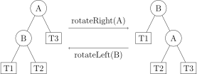

rotateLeft-G:
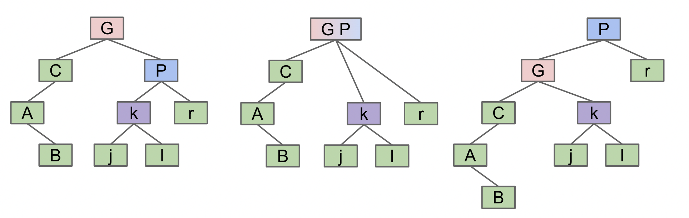

We can also rotate on a non-root node. We just disconnect the node from the parent temporarily, rotate the subtree at the node, then reconnect the new root.

```java
// we are returning x, and other parts of our code will make use of this information to correctly update the parent node's pointer.
private Node rotateRight(Node h) {
    // assert (h != null) && isRed(h.left);
    Node x = h.left;
    h.left = x.right;
    x.right = h;
    return x;
}

// make a right-leaning link lean to the left
private Node rotateLeft(Node h) {
    // assert (h != null) && isRed(h.right);
    Node x = h.right;
    h.right = x.left;
    x.left = h;
    return x;
}
```

四种平衡被破坏的维护方式：
<grid>
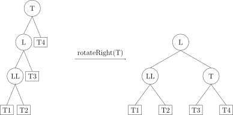
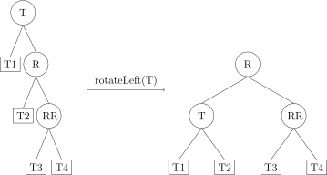
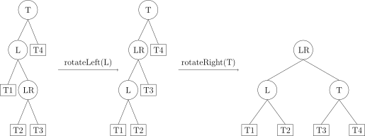

</grid>

[AVL树可视化](https://www.cs.usfca.edu/~galles/visualization/AVLtree.html)

#### B-Trees

##### B树分裂操作

针对一棵高度为 $h$ 的 $m$ 阶 B树，插入一个元素时，首先要验证该元素在 B树中是否存在，如果不存在，那么就要在叶子节点中插入该新的元素，此时分 3 种情况：
1. 如果叶子节点空间足够，即该节点的关键字数小于 $m-1$，则直接插入在叶子节点的左边或右边；
2. 如果空间满了以至于没有足够的空间去添加新的元素，即该节点的关键字数已经有了 $m$ 个，则需要将该节点进行「分裂」，将一半数量的关键字元素分裂到新的其相邻右节点中，中间关键字元素上移到父节点中，而且当节点中关键元素向右移动了，相关的指针也需要向右移。
     - 从该节点的原有元素和新的元素中选择出中位数
    - 小于这一中位数的元素放入左边节点，大于这一中位数的元素放入右边节点，中位数作为分隔值。
    - 分隔值被插入到父节点中，这可能会造成父节点分裂，分裂父节点时可能又会使它的父节点分裂，以此类推。如果没有父节点（这一节点是根节点），就创建一个新的根节点（增加了树的高度）。

一个三阶 B树 插入 25，26：
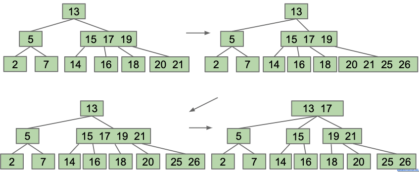

> B-Trees with a limit of 3 items per node are also called 2-3-4 trees or 2-4 trees (a node can have 2, 3, or 4 children). Setting a limit of 2 items per node results in a 2-3 tree.

##### B树特征，用途

**Usage of b-tree**
B-Trees are used mostly in two specific contexts: first, with a small L(阶数) for conceptually balancing search trees, or secondly, with L in the thousands for *databases* and *file systems* with large records.

**B树性质**
- 每个节点最多有 $m$ 个子节点。
- 每一个非叶子节点（除根节点）最少有 $\lceil \dfrac{m}{2} \rceil$ 个子节点。
- 如果根节点不是叶子节点，那么它至少有两个子节点。
- 有 $k$ 个子节点的非叶子节点拥有 $k−1$ 个键，且升序排列，满足 $k[i] < k[i+1]$。
- 所有的叶子节点都在同一层（$\log n$）。

[B树可视化](https://www.cs.usfca.edu/~galles/visualization/BTree.html)

#### Red-Black Trees

We show that a link is a glue link by making it red. Normal links are black. Because of this, we call these structures **left-leaning red-black trees (LLRB)**.

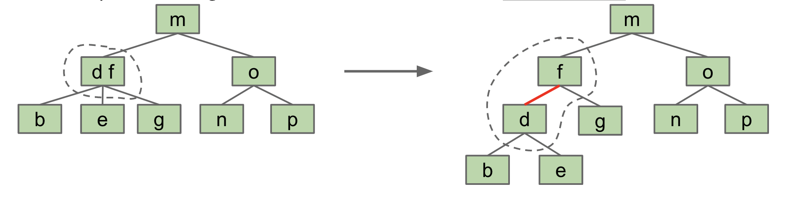

Left-Leaning Red-Black trees have a **1-1 correspondence with** 2-3 trees. Every 2-3 tree has a unique LLRB red-black tree associated with it. 

##### Properties of LLRBs

- 1-1 correspondence with 2-3 trees.
- No node has 2 red links.
- There are no red right-links.
- Every path from root to leaf has the same - number of black links (because 2-3 trees have the same number of links to every leaf).
- Height is no more than `2 * height + 1` of the corresponding 2-3 tree. 
- The height of a red-black tree is proportional to the log of the number of entries.

##### Insertion of LLRBs

When inserting: Use a red link. Insert in the same way as inserting into a BST.
- If there is a right-leaning “3-node”, we have a Left Leaning Violation.
  - Rotate left the appropriate node to fix.
    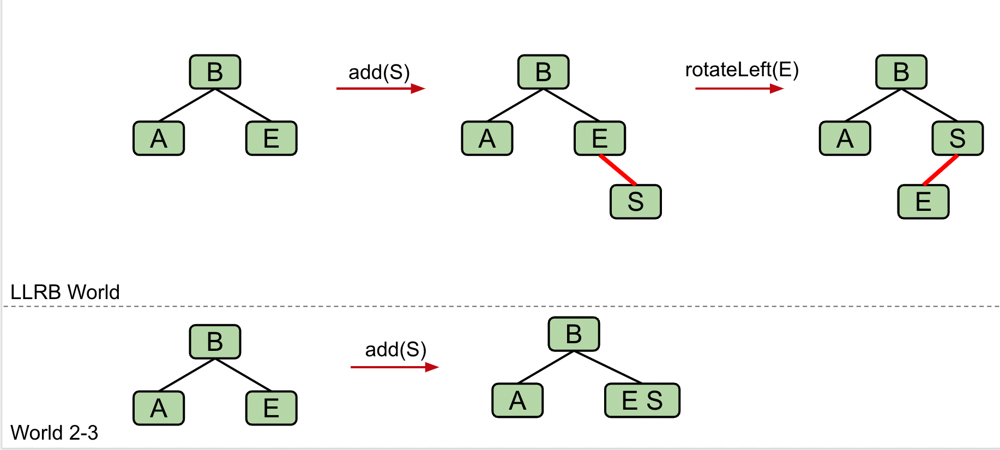
- If there are two consecutive left links, we have an Incorrect 4 Node Violation.
  - Rotate right the appropriate node to fix.
    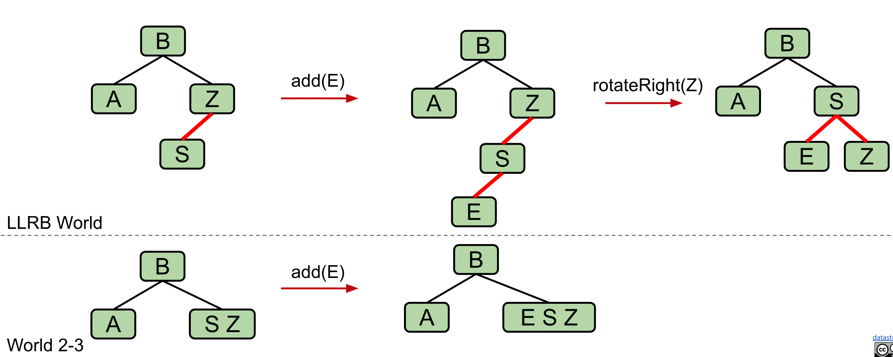
- If there are any nodes with two red children, we have a Temporary 4 Node.
  - Color flip the node to emulate the split operation.
    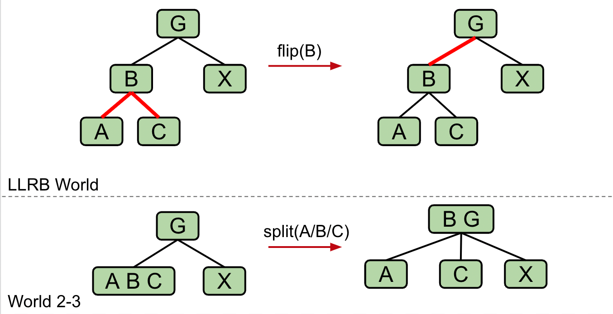

在实现时，可将红色边作为红色结点 -> 插入元素时，默认先插入红色节点

```java
private Node put(Node h, Key key, Value val) {
    if (h == null) { return new Node(key, val, RED); }

    int cmp = key.compareTo(h.key);
    if (cmp < 0)      { h.left  = put(h.left,  key, val); }
    else if (cmp > 0) { h.right = put(h.right, key, val); }
    else              { h.val   = val;                    }

    if (isRed(h.right) && !isRed(h.left))      { h = rotateLeft(h);  }
    if (isRed(h.left)  &&  isRed(h.left.left)) { h = rotateRight(h); }
    if (isRed(h.left)  &&  isRed(h.right))     { flipColors(h);      } 

    return h;
}
```

- Binary search trees are simple, but they are subject to imbalance which leads to crappy runtime. 2-3 Trees (B Trees) are balanced, but painful to implement.
- LLRB insertion is simple to implement (deletion is a bit harder to implement).
  - Use three basic operations to maintain the balanced structure, namely `rotateLeft`, `rotateRight`, and `colorFlip`.
- LLRBs maintain correspondence with 2-3 trees, Standard Red-Black trees maintain correspondence with 2-3-4 trees.
  - Java’s `TreeMap` is a red-black tree that corresponds to 2-3-4 trees.
  - 2-3-4 trees allow glue links on either side.
  - More complex implementation, but faster.

## Hashing

**Brute force approach.** All data is just a sequence of bits. Can treat key as a gigantic number and use it as an array index. Requires exponentially large amounts of memory.

**Hashing.** Instead of using the entire key, represent entire key by a smaller value. In Java, we hash objects with a `hashCode()` method that returns an integer (32 bit) representation of the object.

**hashCode() to index conversion.** To use `hashCode()` results as an index, we must convert the `hashCode()` to a valid index. Modulus does not work since hashCode may be negative. Taking the absolute value then the modulus also doesn’t work since `Math.abs(Integer.MIN_VALUE)` is negative. Typical approach: use `hashCode & 0x7FFFFFFF` or `Math.floorMod(key.hashCode(), array.length)` instead before taking the modulus.

**Hash function.** Converts a key to a value between 0 and M-1. In Java, this means calling hashCode(), setting the sign bit to 0, then taking the modulus.

**Designing good hash functions.** Requires a blending of sophisticated mathematics and clever engineering; beyond the scope of this course. Most important guideline is to use all the bits in the key. If `hashCode()` is known and easy to invert, adversary can design a sequence of inputs that result in everything being placed in one bin. Or if `hashCode()` is just plain bad, same thing can happen.

**Collision resolution.** Two philosophies for resolving collisions discussed in class: Separate (a.k.a. external) chaining and ‘open addressing’.

**Separate-chaining hash table.** Key-value pairs are stored in a linked list of nodes of length M. Hash function tells us which of these linked lists to use. Get and insert both require potentially scanning through entire list.

**Resizing separate chaining hash tables.** Understand how resizing may lead to objects moving from one linked list to another. Primary goal is so that M is always proportional to N, 
$$
\rm load \ factor = \frac {size()} {array.length}
$$
i.e. maintaining a load factor bounded above by some constant.

**Performance of separate-chaining hash tables.** Cost of a given `get`, `insert`, or `delete` is given by number of entries in the linked list that must be examined.
- The expected amortized search and insert time (assuming items are distributed evenly) is N / M, which is no larger than some constant (due to resizing).

**Open-addressing hash tables.** 
- 线性探测
- 平方探测
- 多次哈希

## Heaps & Priority Queues

堆是一棵树，其每个节点都有一个键值，且每个节点的键值都大于等于/小于等于其父亲的键值。

### 二叉堆

We will define our binary min/max-heap as being complete and obeying min/max-heap property:
- **Min-heap**: Every node is less/greater than or equal to both of its children
- **Complete**: Missing items only at the bottom level (if any), all nodes are as far left as possible.

### Tree Representation

- Approach 1 (explicit link)
  - 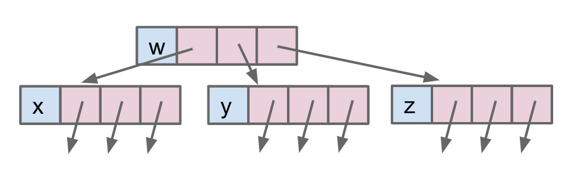
    -  These are hardwired links that give us fixed-width nodes. 
  - 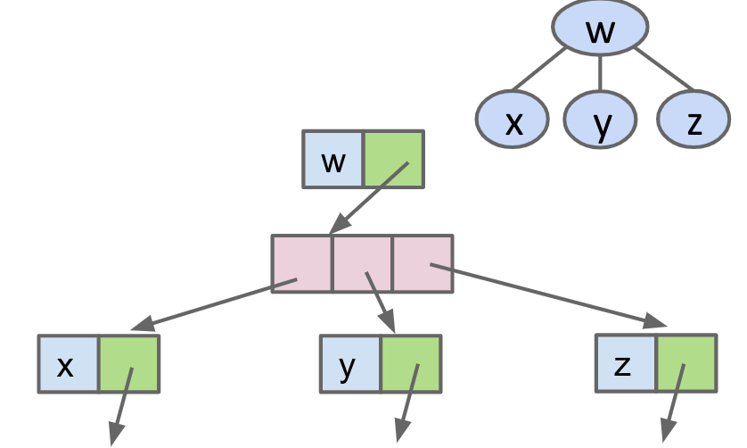
    - This would give us variable-width nodes, but also awkward traversals and performance will be worse.
  - 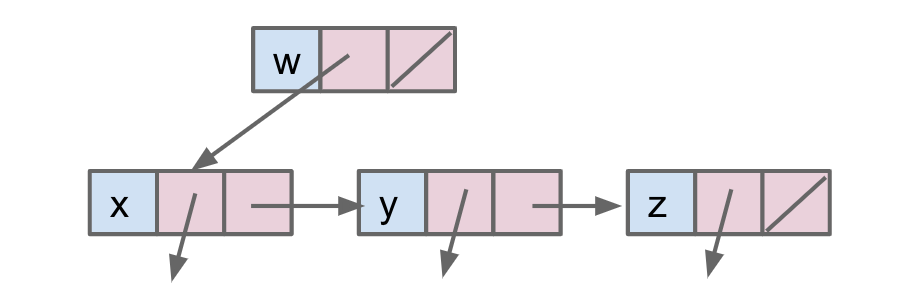
- Approach 2 (2 arrays)
  ``` java
  public class Tree2<Key> {
    Key[] keys;
    int[] parents;
    ...
  }
  ```
  - 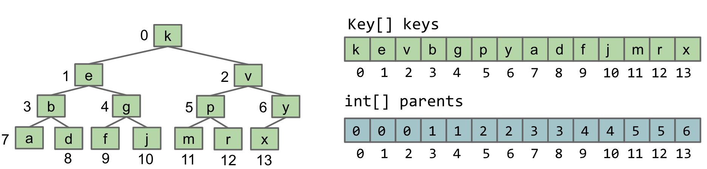
- Approach 3 (only 1 array)
  ```java
  public class TreeC<Key> {
    Key[] keys;
    ...
  }
  ```
  - 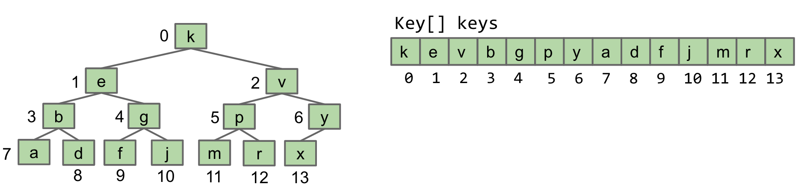
  - **Can only be used for complete tree!!**
  - the first item in array can be skipped and we can start the root in index 1, which make the calculation much more simply.
    - `leftChild(k) = keys[k * 2];`
    - `rightChild(k) = keys[k * 2 + 1];`
    - `parent(k) = keys[k / 2];`

### Priority Queues

```java
/** (Min) Priority Queue: Allowing tracking and removal of 
  * the smallest item in a priority queue. */
public interface MinPQ<Item> {
    /** Adds the item to the priority queue. */
    public void add(Item x);
    /** Returns the smallest item in the priority queue. */
    public Item getSmallest();
    /** Removes the smallest item from the priority queue. */
    public Item removeSmallest();
    /** Returns the size of the priority queue. */
    public int size();
}
```

- `add`: Add to the end of heap temporarily. Swim up the hierarchy to the proper place.
  - Swimming involves swapping nodes if child < parent
- `getSmallest`: Return the root of the heap (This is guaranteed to be the minimum by our min-heap property)
- `removeSmallest`: Swap the last item in the heap into the root. Sink down the hierarchy to the proper place.
  - Sinking involves swapping nodes if parent > child. Swap with the smallest child to preserve min-heap property.

|Methods|Ordered Array|Bushy BST|Hash Table|Heap|
|:-|:-|:-|:-|:-|
|`add`|$\Theta (N)$|$\Theta (\log N)$|$\Theta (1)$|$\Theta (\log N)$|
|`getSmallest`|$\Theta (1)$|$\Theta (\log N)$|$\Theta (N)$|$\Theta (1)$|
|`removeSmallest`|$\Theta (N)$|$\Theta (\log N)$|$\Theta (N)$|$\Theta (\log N)$|

- Heap operations are amortized analysis, since the array will have to resize (not a big deal)
- BST's can have constant time getSmallest if pointer is stored to smallest element
- Array-based heaps take around 1/3rd the memory it takes to represent a heap using approach 1A (direct pointers to children)


## Sorting

|Methods|Best Case Runtime|Worst Case Runtime|Space|Demo|
|:-|:-|:-|:-|:-|
|Selection Sort|$\Theta (N^2)$|$\Theta (N^2)$|$\Theta (1)$|[Link](http://goo.gl/8Fbda5)|
|Heap Sort (in place)|$\Theta (N)$|$O (N\log N)$|$\Theta (1)$|[Link](https://docs.google.com/presentation/d/1z1lCiLSVLKoyUOIFspy1vxyEbe329ntLAVDQP3xjmnU/pub?start=false&loop=false&delayms=3000)|
|Merge Sort|$\Theta (N\log N)$|$\Theta (N\log N)$|$\Theta (N)$|[Link](https://docs.google.com/presentation/d/1h-gS13kKWSKd_5gt2FPXLYigFY4jf5rBkNFl3qZzRRw/pub?start=false&loop=false&delayms=3000)|
|Insertion Sort (in place)|$\Theta (N)$|$\Theta (N^2)$|$\Theta (1)$|[Link](https://docs.google.com/presentation/d/10b9aRqpGJu8pUk8OpfqUIEEm8ou-zmmC7b_BE5wgNg0/pub?start=false&loop=false&delayms=3000)|
|Shell's Sort|$\Theta (N)$|$\Omega (N\log N) \newline O(?)$|$\Theta (1)$|N/A|
|Quick Sort|$\Theta(N \log N)$|$\Theta(N^2)$|$\Theta (1)$|[Link](https://docs.google.com/presentation/d/1QjAs-zx1i0_XWlLqsKtexb-iueao9jNLkN-gW9QxAD0/edit?usp=sharing)|

排序算法的评价维度主要有四类：**稳定性，就地性，自适应性**

**稳定性**
排序算法的稳定性其实就是只在排序之后，相同值元素在数据文件中的相对位置是否发生变化
- 稳定排序：在完成排序后，不改变 相等元素在数组中的相对顺序
- 非稳定排序：在完成排序后，相等元素在数组中的相对位置 可能被改变

**就地性**
就地性其实就是看排序算法是否需要借助额外的空间进行排序
- 原地排序：不需要使用额外的辅助空间
- 非原地排序：需要使用额外的辅助空间

**自适应性**
自适应性其实就是排序算法的时间复杂度受输入数据影响
- 自适应排序：时间复杂度受输入数据影响，即最佳 / 最差 / 平均时间复杂度不相等。
- 非自适应排序：时间复杂度恒定，与输入数据无关。


**Inversions.** The number of pairs of elements in a sequence that are out of order. An array with no inversions is ordered.

### Selection Sort

One way to sort is by selection: Repeatedly identifying the most extreme element and moving it to the end of the unsorted section of the array. The naive implementation of such an algorithm is in place.

### Heap Sort

> A variant of selection sort

#### Naive Version

Insert all items into a MaxPQ and then remove them one by one. The first such item removed is placed at the end of the array, the next item right before the end, and so forth until that last item deleted is placed in position 0 of the array.

**Analysis**
- Each insertion and deletion takes $O(\log N)$ time, and there are $N$ insertions and deletions, resulting in a $O(N \log N)$ runtime. 
- Every remove from MaxPQ needs $\Theta(1)$ time, resulting in a $\Theta(N)$ runtime

Overall runtime = $O(N\log N)$

> If all elements are equal, Overall runtime = $\Theta (N)$

This naive version of heap sort uses $\Theta (N)$ for the PQ. Creation of the MaxPQ requires $\Theta (N)$ memory. 

It is also possible to use a MinPQ instead.

#### In-place Version

When sorting an array, we can avoid the $\Theta (N)$ memory cost by treating the array itself as a heap. 
To do this, we first heapify the array using **bottom-up heap construction** (倒序开始，每个都元素都尽量下沉 -> 从下到上构建二叉堆，为了方便计算使用大项堆) (taking $\Theta(N)$ time). We then repeatedly delete the max item, swapping it with the last item in the heap. Over time, the heap shrinks from N items to 0 items, and the sorted list from 0 items to N items. The resulting version is also $\Theta(N \log N)$.

### Merge Sort

Mergesort is $\Theta(N \log N)$ (分 $\log N$ 层，每层合并都要遍历 $N$ 个元素) and uses $\Theta(N)$ memory.

### Insertion Sort

For each item, insert into the output sequence in the appropriate place. Naive solution involves creation of a separate data structure. 

The memory efficient version of this algorithm swaps items one-by-one towards the left until they land in the right place, without creation of extra array. Every item to the left of position i is in sorted order, and everything to the right has not yet been examined. **Every swap fixes exactly one inversion.**

**Analysis**

- In the best case, insertion sort takes $\Theta(N)$ time. 
- In the worst case, $\Theta(N^2)$ --in a reverse-sorted array, we have to swap every item all the way to the front. 

**Advantage of Insertion Sort**

- On sorted or almost-sorted arrays, insertion sort does very little work. In fact, the number of swaps that it does is equal to the number of inversions in the array.
  - On arrays with a small number of inversions, insertion sort is probably the fastest sorting algorithm. The runtime is $\Theta (N + K)$, where $K$ is the number of inversions in the array. If we define an almost-sorted array as one where the number of inversions $K < cN$ for some constant $c$, then insertion sort runs in linear time.
- Insertion sort is extremely fast on small arrays, usually of size 15 or less. In fact, the Java implementation of mergeSort uses insertion sort when the split becomes less than 15 items. 

### Shell's Sort

> 是插入排序的一种改进版本，但是是不稳定排序。

**Big idea: Fix multiple inversions at once.**

Idea is to compare items that are a distance h apart from each other, starting from large h and reducing down to h=1. The last step where h=1 ensures that the array is sorted (since h=1 is just insertion sort). The earlier steps help speed things up by making long distance moves, fixing many inversions at once.

时间复杂度：希尔排序的时间复杂度比较难证明，希尔增量的最坏时间复杂度还是 $O(N^2)$。

一些经过优化的增量序列如

- Hibbard序列 $h(gap) = 2^k - 1$ 
- Knuth序列 $h_1 = 1, h_{i + 1} = 3h_i + 1$

经过复杂证明可使得最坏时间复杂度为 $O(N^{1.5})$。

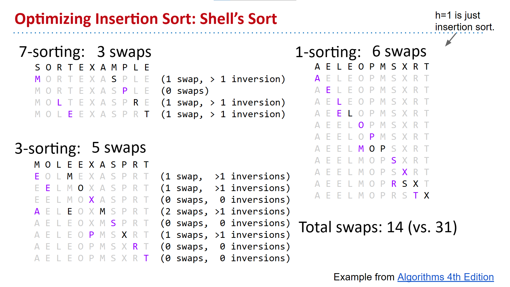

### Quick Sort

**Partitioning.** Partitioning an array on a pivot means to rearrange the array such that all items to the left of the pivot are ≤ the pivot, and all items to the right are ≥ the pivot.

**Quicksort.** Partition on some pivot. Quicksort to the left of the pivot. Quicksort to the right.

**Quicksort Runtime.** Understand how to show that in the best case, Quicksort has runtime $\Theta(N\log N)$, and in the worse case has runtime $\Theta(N^2)$.

**Quicksort properties.** For most real world situations, quicksort is the fastest sort.

#### 快排优化

**Pivot Selection.** 

- Use leftmost item
- Pick the middle item of the left-most, right-most and middle-index elements
- Pick a random pivot

**Partitioning Method.**

- Scan the whole array 3 times
- Hoare Partitioning:
  - [Demo](https://docs.google.com/presentation/d/1DOnWS59PJOa-LaBfttPRseIpwLGefZkn450TMSSUiQY/pub?start=false&loop=false&delayms=3000)
  - Left pointer loves small items.
    Right pointer loves large items.
    Big idea: Walk towards each other, swapping anything they don’t like.
      - End result is that things on left are “small” and things on the right are “large”.
- 3-way quicksort
  - 与原始的快速排序不同，三路快速排序在随机选取分界点 m 后，将待排数列划分为三个部分：小于 m、等于 m 以及大于 m。这样做即实现了将与分界元素相等的元素聚集在分界元素周围这一效果。

**Shuffle before sorting**

**当序列较短（短于 15 ）时，使用 插入排序 效率更高**

#### Quick Select

Using partitioning, we can solve the selection problem in expected linear time. The algorithm is to simply partition the array, and then quick select on the side of the array containing the median. Best case time is $\Theta (N)$, expected time is $\Theta (N)$, and worst case time is $\Theta (N^2)$. You should know how to show the best and worst case times. This algorithm is the fastest known algorithm for finding the median.

## Trees Traversals

**Traversals.** When we iterate over a tree, we call this a “tree traversal”.

**Depth First Traversals.** We have three depth first traversals: Pre-order, in-order and post-order. In a pre-order traversal, we visit a node, then traverse its children. In an in-order traversal, we traverse the left child, visit a node, then traverse the right child. In a post-order traversal, we traverse both children before visiting. These are very natural to implement recursively. Pre-order and post-order generalize naturally to trees with arbtirary numbers of children. In-order only makes sense for binary trees.

**Level Order Traversal.** A level-order traversal visits every item at level 0, then level 1, then level 2, and so forth. One typical implementation for a level order traversal is an iterative-deepening strategy.

## Graphs